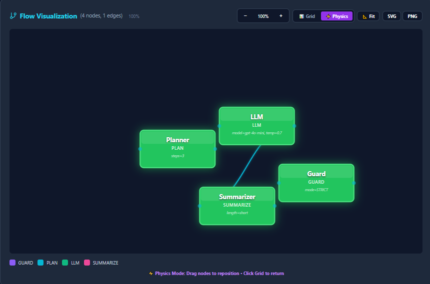

# AetherLang Ω

<div align="center">


[](https://www.python.org/)
[](https://openai.com/)
[](LICENSE)
[](https://github.com/contrario/aetherlang)

**A powerful Domain-Specific Language for AI Workflow Orchestration**

[Documentation](docs/) • [Examples](examples/) • [Getting Started](#-quick-start) • [Live Demo](https://neurodoc.app/aether-nexus-omega-dsl)

</div>

---

## 🌟 What is AetherLang?

AetherLang (Ω) is a **production-ready DSL** designed specifically for building, visualizing, and executing complex AI workflows. Think of it as **"Airflow meets Prefect"** but with a clean, declarative syntax optimized for LLM orchestration.

<p align="center">
  
  <br/>
  <em>End-to-end AI workflow orchestration with visual debugging</em>
</p>

### 🖼️ Visual Interface

<p align="center">
  
  <br/>
  <em>Professional code editor with syntax highlighting and real-time validation</em>
</p>

### 🎨 Flow Visualization

<p align="center">
  
  
  <br/>
  <em>Interactive visual debugger with Grid and Physics modes</em>
</p>

### ✅ Execution Results

<p align="center">
  
  <br/>
  <em>Real-time execution with comprehensive output (supports Greek and English)</em>
</p>

### ✨ Key Features

- 🎯 **28 Specialized Node Types** - Guards, LLMs, RAG, caching, validation, and more
- 🔄 **Async Execution Engine** - Built-in async/await with OpenAI integration
- 🎨 **Visual Flow Designer** - Real-time interactive diagrams with live execution visualization
- 🌐 **Bilingual Support** - Greek & English documentation and syntax
- ⚡ **Live Execution Streaming** - WebSocket-based real-time node state updates
- 🧪 **Comprehensive Validation** - Type checking, cycle detection, and semantic analysis
- 🚀 **Zero External Dependencies** - Pure Python implementation (except OpenAI SDK)
- 📊 **Physics-Based Layout** - Force-directed graph visualization with drag & drop
- 💾 **Export & Import** - Export flows as JSON for sharing and version control
- 🔧 **Monaco Editor Integration** - Professional code editing experience with IntelliSense
- 📈 **Performance Profiling** - Built-in profiler for bottleneck detection and optimization
- 🧠 **AI-Powered Optimization** - GPT-4o analyzes your flows and suggests improvements

---

## 🚀 Quick Start

### Installation

```bash
pip install aetherlang
```

Or install from source:

```bash
git clone https://github.com/contrario/aetherlang.git
cd aetherlang
pip install -e .
```

### Your First Flow

Create a file `hello.ae`:

```aetherlang
flow HelloAether {
  using target "neuroaether" version ">=0.2";

  input text query;

  node Guard: guard mode="STRICT";
  node LLM: llm model="gpt-4o-mini", temp=0.7;
  node Summarizer: summarize length="short";

  Guard -> LLM -> Summarizer;

  output text summary from Summarizer;
}
```

Execute it:

```python
from aetherlang import AetherParser, AetherRuntime
import asyncio

# Parse the flow
parser = AetherParser()
with open("hello.ae") as f:
    flow = parser.parse(f.read())

# Execute
runtime = AetherRuntime(openai_api_key="your-key")
result = asyncio.run(runtime.execute(flow, {"query": "What is AetherLang?"}))

print(result["outputs"]["summary"])
```

---

## 📚 Language Syntax

### Flow Declaration

```aetherlang
flow MyFlow {
  using target "neuroaether" version ">=0.2";

  // Inputs
  input text query;
  input number max_tokens;

  // Nodes
  node NodeName: node_type param1="value", param2=123;

  // Connections
  NodeA -> NodeB -> NodeC;

  // Outputs
  output text result from NodeC;
}
```

### Node Types (28 Available)

| Category | Nodes |
|----------|-------|
| **Control** | `guard`, `plan`, `switch`, `conditional`, `loop`, `parallel` |
| **AI/LLM** | `llm`, `rag`, `summarize`, `analyze`, `extract`, `transform` |
| **Data** | `filter`, `map`, `reduce`, `split`, `merge`, `join` |
| **System** | `cache`, `retry`, `timeout`, `fallback`, `validate`, `http`, `webhook` |
| **Other** | `sleep`, `enrich`, `rate_limit` |

Full documentation: [docs/nodes.md](docs/nodes.md)

---

## 🎨 Visual Flow Designer

AetherLang includes a **production-grade visual designer** with:

- ⚡ **Real-time visualization** - See your flow as you type
- 🎭 **Live execution** - Watch nodes turn blue (running) → green (complete)
- 🌊 **Animated data flow** - See data flowing through edges
- 🧲 **Physics-based layout** - Drag & drop nodes with force-directed positioning
- 📊 **Zoom & Pan** - Navigate large flows (30%-300% zoom)
- 💾 **Export** - SVG vector graphics & high-res PNG (2x)
- 🎯 **Interactive tooltips** - Hover for node details, click to highlight connections

**Try it live:** [neurodoc.app/aether-nexus-omega-dsl](https://neurodoc.app/aether-nexus-omega-dsl)

<div align="center">


*Interactive flow visualization with real-time execution tracking*

</div>

---

## 💡 Example Workflows

### 1. RAG Pipeline

```aetherlang
flow RAGPipeline {
  using target "neuroaether" version ">=0.2";

  input text question;

  node Cache: cache ttl=3600;
  node Retriever: rag sources=["docs", "web"], top_k=5;
  node LLM: llm model="gpt-4o", temp=0.3;
  node Validator: validate schema="answer";

  Cache -> Retriever -> LLM -> Validator;

  output text answer from Validator;
}
```

### 2. Multi-Path Analysis

```aetherlang
flow MultiAnalysis {
  using target "neuroaether" version ">=0.2";

  input text document;

  node Guard: guard mode="STRICT";
  node PathA: summarize length="short";
  node PathB: analyze depth="deep";
  node PathC: extract entities=["person", "org"];
  node Merger: merge strategy="concat";

  Guard -> PathA -> Merger;
  Guard -> PathB -> Merger;
  Guard -> PathC -> Merger;

  output text combined from Merger;
}
```

### 3. Greek Education Assistant

```aetherlang
flow GreekTutor {
  using target "neuroaether" version ">=0.2";

  input text mathema;  // Μάθημα
  input text taxi;     // Τάξη

  node Planner: plan steps=3;
  node Educator: llm model="gpt-4o-mini",
                     system="Είσαι δάσκαλος δημοτικού";
  node Simplifier: summarize length="short",
                            style="educational";

  Planner -> Educator -> Simplifier;

  output text explanation from Simplifier;
}
```

More examples: [examples/](examples/)

---

## 🏗️ Architecture

```
┌─────────────────────────────────────────┐
│          AetherLang Architecture        │
├─────────────────────────────────────────┤
│                                         │
│  Parser (parser.py)                     │
│  ├─ Lexical analysis                    │
│  ├─ Syntax parsing                      │
│  ├─ AST construction                    │
│  └─ Error reporting                     │
│                                         │
│  Validator (validator.py)               │
│  ├─ Type checking                       │
│  ├─ Dependency analysis                 │
│  ├─ Cycle detection                     │
│  └─ Semantic validation                 │
│                                         │
│  Runtime (runtime.py)                   │
│  ├─ Async execution engine              │
│  ├─ Topological sort scheduler          │
│  ├─ OpenAI integration                  │
│  ├─ Node orchestration                  │
│  └─ Error handling                      │
│                                         │
│  Examples (examples.py)                 │
│  └─ Built-in flow templates            │
│                                         │
└─────────────────────────────────────────┘
```

---

## 📖 Documentation

- **[Getting Started](docs/getting-started.md)** - Installation, first flow, basics
- **[Syntax Guide](docs/syntax.md)** - Complete language syntax reference
- **[Node Reference](docs/nodes.md)** - All 28 node types with examples
- **[API Documentation](docs/api.md)** - Python API for parser, runtime, validator
- **[Visual Designer](https://neurodoc.app/aether-nexus-omega-dsl)** - Interactive live demo

---

## 🛠️ Development

### Running Tests

```bash
pytest tests/
```

### Development Setup

```bash
# Clone repository
git clone https://github.com/contrario/aetherlang.git
cd aetherlang

# Create virtual environment
python -m venv venv
source venv/bin/activate  # On Windows: venv\Scripts\activate

# Install in development mode
pip install -e .

# Install development dependencies
pip install pytest black flake8 mypy
```

### Code Style

- Use `black` for formatting
- Use `flake8` for linting
- Use `mypy` for type checking

---

## 🤝 Contributing

Contributions are welcome! Please:

1. Fork the repository
2. Create a feature branch (`git checkout -b feature/amazing-feature`)
3. Commit your changes (`git commit -m 'Add amazing feature'`)
4. Push to the branch (`git push origin feature/amazing-feature`)
5. Open a Pull Request

---

## 📊 Comparison with Other Tools

| Feature | Airflow | Prefect | Dagster | n8n | **AetherLang** |
|---------|---------|---------|---------|-----|----------------|
| DSL Syntax | Python | Python | Python | Visual | **Custom DSL** |
| Visual Designer | ✅ | ✅ | ✅ | ✅ | ✅ |
| Live Execution | ❌ | ✅ | ❌ | ❌ | ✅ |
| AI-First Design | ❌ | ❌ | ❌ | ❌ | ✅ |
| Animated Flow | ❌ | ❌ | ❌ | ❌ | ✅ |
| Physics Layout | ❌ | ❌ | ❌ | ❌ | ✅ |
| Bilingual | ❌ | ❌ | ❌ | ✅ | ✅ |
| Zero Dependencies | ❌ | ❌ | ❌ | ❌ | ✅ |

---

## 🎯 Use Cases

- **🤖 LLM Orchestration** - Chain multiple AI models with guardrails
- **📚 RAG Pipelines** - Retrieval-augmented generation workflows
- **🎓 Educational Tools** - Greek education content generation
- **📊 Data Processing** - Transform, analyze, and enrich data
- **🔄 API Integrations** - Webhook handling and HTTP calls
- **🧪 Research Workflows** - Multi-step analysis and synthesis

---

## 🌐 Community

- **Website**: [neurodoc.app](https://neurodoc.app/aether-nexus-omega-dsl)
- **Issues**: [GitHub Issues](https://github.com/contrario/aetherlang/issues)
- **Discussions**: [GitHub Discussions](https://github.com/contrario/aetherlang/discussions)

---

## 📄 License

This project is licensed under the **MIT License** - see the [LICENSE](LICENSE) file for details.

```
MIT License

Copyright (c) 2025 AetherLang Contributors

Permission is hereby granted, free of charge, to any person obtaining a copy
of this software and associated documentation files (the "Software"), to deal
in the Software without restriction, including without limitation the rights
to use, copy, modify, merge, publish, distribute, sublicense, and/or sell
copies of the Software, and to permit persons to whom the Software is
furnished to do so, subject to the following conditions:

The above copyright notice and this permission notice shall be included in all
copies or substantial portions of the Software.

THE SOFTWARE IS PROVIDED "AS IS", WITHOUT WARRANTY OF ANY KIND, EXPRESS OR
IMPLIED, INCLUDING BUT NOT LIMITED TO THE WARRANTIES OF MERCHANTABILITY,
FITNESS FOR A PARTICULAR PURPOSE AND NONINFRINGEMENT. IN NO EVENT SHALL THE
AUTHORS OR COPYRIGHT HOLDERS BE LIABLE FOR ANY CLAIM, DAMAGES OR OTHER
LIABILITY, WHETHER IN AN ACTION OF CONTRACT, TORT OR OTHERWISE, ARISING FROM,
OUT OF OR IN CONNECTION WITH THE SOFTWARE OR THE USE OR OTHER DEALINGS IN THE
SOFTWARE.
```

---

## 🙏 Acknowledgments

- Built with ❤️ by the AetherLang team
- Powered by [OpenAI](https://openai.com/)
- Inspired by Airflow, Prefect, and modern workflow orchestration tools
- Special thanks to all contributors

---

## 📈 Stats


---

<div align="center">

**Made with 🚀 by [AetherLang Team](https://github.com/contrario)**

[⭐ Star us on GitHub](https://github.com/contrario/aetherlang) • [🐛 Report Bug](https://github.com/contrario/aetherlang/issues) • [✨ Request Feature](https://github.com/contrario/aetherlang/issues)

</div>
