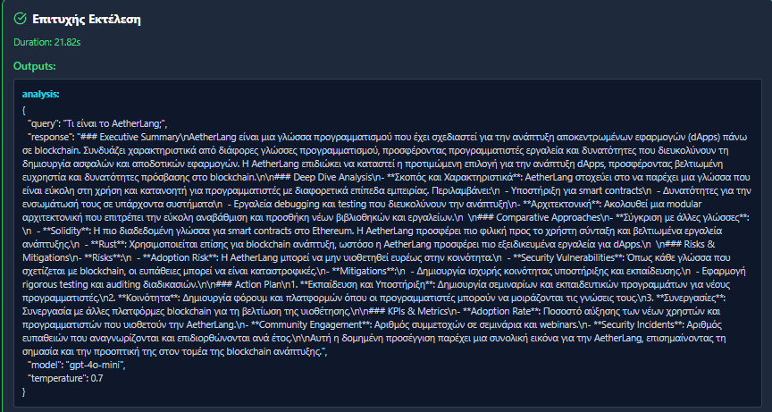
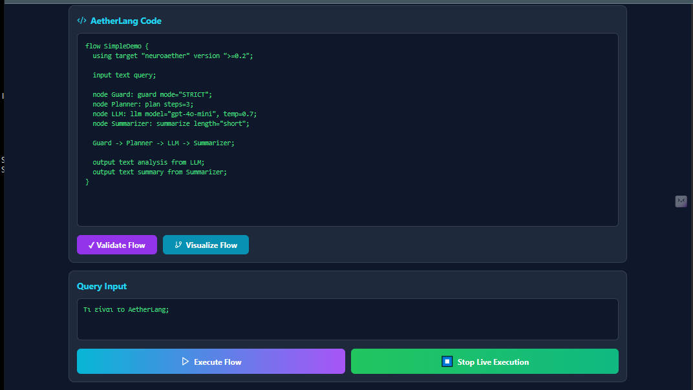
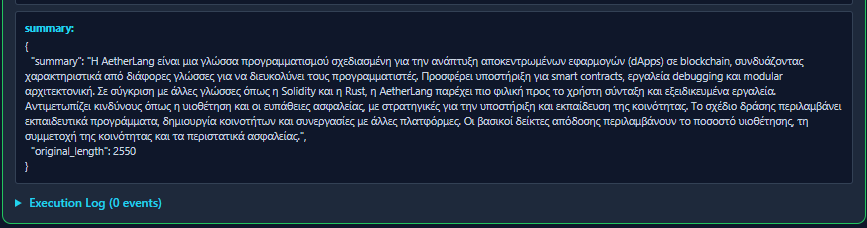
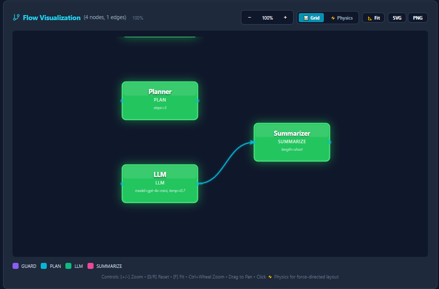

# AetherLang Ω

<div align="center">


[](https://www.python.org/)
[](https://openai.com/)
[](LICENSE)
[](https://github.com/contrario/aetherlang)
[](https://clawhub.ai/skills/aetherlang)

**A powerful Domain-Specific Language for AI Workflow Orchestration**
**39 Node Types · 14 Example Flows · Domain-Specific AI Engines · OpenClaw Integration**

[Live Demo](https://neurodoc.app/aether-nexus-omega-dsl) · [ClawHub Skill](https://clawhub.ai/skills/aetherlang) · [Documentation](docs/) · [Examples](examples/)

</div>

---


## 🎬 Demo

[](https://www.loom.com/share/92bc1bd7c72f4250a365d422b2b615ab)

## 🌟 What is AetherLang?

AetherLang (Ω) is a **production-ready DSL** designed specifically for building, visualizing, and executing complex AI workflows. Think of it as **"Airflow meets Prefect"** but with a clean, declarative syntax optimized for LLM orchestration.

Instead of writing single prompts, AetherLang lets you **chain specialized AI nodes** into powerful pipelines:
```
Guard → Research → Consult → Market → APEX
  ↓         ↓          ↓         ↓        ↓
Safety   Deep dive   SWOT    TAM/SAM   Nobel-level
check    analysis    matrix   /SOM     strategy
```

**Built in 40 days by a solo founder. No traditional programming background. Pure AI collaboration.**

<p align="center">
  
  <br/>
  <em>End-to-end AI workflow orchestration with visual debugging</em>
</p>

---

## 🦞 OpenClaw Integration

AetherLang is available as an **OpenClaw Skill** on [ClawHub](https://clawhub.ai/skills/aetherlang). Any OpenClaw user can run AetherLang flows from WhatsApp, Telegram, Discord, or any supported platform.

**Install:**
```bash
clawhub install aetherlang
```

**Then from WhatsApp/Telegram:**
> "Make me a Greek moussaka recipe with food costing"
> "Analyze the European AI SaaS market for 2026"
> "Should I start a restaurant in Berlin? Full business analysis"

The OpenClaw agent constructs and executes AetherLang flows automatically.

---

## ✨ Key Features

- 🎯 **39 Specialized Node Types** — including 11 domain-specific V2 engines
- 🍳 **Chef Omega** — Michelin-level recipes with food costing, HACCP, and MacYuFBI flavor balance
- 🧬 **APEIRON Molecular** — Scientific gastronomy with physics engines and FDA safety
- 📊 **APEX Strategy** — Nobel-level business analysis with ROI/NPV/IRR projections
- 🧠 **GAIA Brain Assembly** — 12-neuron multi-agent system for multi-perspective analysis
- 🔮 **OMNI-COMPUTE Oracle** — Adversarial forecasting with Nash equilibrium simulation
- 📈 **McKinsey Market** — Market intelligence with TAM/SAM/SOM and Porter's 5 Forces
- 🔬 **Deep Research** — Comprehensive analysis with confidence levels and cited sources
- 🏗️ **NEXUS-7 Consult** — Architectural blueprinting for system design
- 🎨 **Visual Flow Designer** — Real-time interactive diagrams with live execution
- 🌐 **Bilingual Support** — Greek & English documentation and output
- ⚡ **Async Execution Engine** — Built-in async/await with OpenAI integration
- 🦞 **OpenClaw Skill** — Run flows from WhatsApp/Telegram via OpenClaw
- 📊 **Performance Profiling** — Built-in profiler for bottleneck detection
- 💾 **Export & Import** — Export flows as JSON for sharing and version control

---

## 🚀 Quick Start

### Installation
```bash
pip install aetherlang
```

Or install from source:
```bash
git clone https://github.com/contrario/aetherlang.git
cd aetherlang
pip install -e .
```

### Your First Flow
```aetherlang
flow HelloAether {
  using target "neuroaether" version ">=0.2";

  input text query;

  node Guard: guard mode="STRICT";
  node LLM: llm model="gpt-4o-mini", temp=0.7;
  node Summarizer: summarize length="short";

  Guard -> LLM -> Summarizer;

  output text summary from Summarizer;
}
```

Execute it:
```python
from aetherlang import AetherParser, AetherRuntime
import asyncio

parser = AetherParser()
with open("hello.ae") as f:
    flow = parser.parse(f.read())

runtime = AetherRuntime(openai_api_key="your-key")
result = asyncio.run(runtime.execute(flow, {"query": "What is AetherLang?"}))
print(result["outputs"]["summary"])
```

---

## 🧠 V2 Domain-Specific Nodes

AetherLang V2 introduces **11 specialized AI engines**, each with production-grade prompts from the NeuroAether ecosystem:

### 🍳 Chef Omega — Professional Recipe Engine
```aetherlang
flow Recipe {
  using target "neuroaether" version ">=0.2";
  input text query;
  node G: guard mode="MODERATE";
  node C: chef cuisine="greek", difficulty="hard", servings=4;
  G -> C;
  output text recipe from C;
}
```

Generates complete recipes with exact grams, temperatures in °C, food cost %, HACCP safety points, MacYuFBI flavor balance, menu engineering categories (STAR/PLOWHORSE/PUZZLE/DOG), wine pairing, and zero-waste suggestions.

### 🧬 APEIRON Molecular — Scientific Gastronomy
```aetherlang
flow Molecular {
  using target "neuroaether" version ">=0.2";
  input text query;
  node G: guard mode="MODERATE";
  node M: molecular complexity="advanced";
  G -> M;
  output text analysis from M;
}
```

4 engines: Molecular Architect (Physics), Chronos Fermentor (Biology), Bio-Safety Core (Toxicology), Apeiron Nexus (Synthesis).

### 📊 APEX — Nobel-Level Business Strategy
```aetherlang
flow Strategy {
  using target "neuroaether" version ">=0.2";
  input text query;
  node G: guard mode="STRICT";
  node R: research depth="comprehensive";
  node A: apex mode="standard";
  G -> R -> A;
  output text strategy from A;
}
```

9 sections: Executive Summary, Situation Analysis, Strategic Options (min 3 with ROI), Implementation Roadmap (4 phases), Risk Matrix, Financial Projections (NPV/IRR), KPIs, and Next Immediate Actions.

### 🔮 Oracle — Adversarial Forecasting
```aetherlang
flow Forecast {
  using target "neuroaether" version ">=0.2";
  input text query;
  node G: guard mode="MODERATE";
  node O: oracle timeframe="12months";
  G -> O;
  output text forecast from O;
}
```

### 🧠 GAIA Brain Assembly — Multi-Agent Panel
```aetherlang
flow Assembly {
  using target "neuroaether" version ">=0.2";
  input text query;
  node G: guard mode="MODERATE";
  node A: assembly;
  node B: balance focus="both";
  G -> A -> B;
  output text verdict from B;
}
```

12 neurons: Culinary, Sensory, Nutrition, Waste, Molecular, Safety, Agrifood, Hospitality, Memory Vault, Meta-Nous, QML Optimizer, API Integrator.

### 🏗️ Full Consulting Pipeline
```aetherlang
flow FullConsulting {
  using target "neuroaether" version ">=0.2";
  input text query;
  node G: guard mode="STRICT";
  node R: research depth="comprehensive";
  node C: consult domain="business", framework="SWOT";
  node M: market scope="global", timeframe="2026";
  node A: apex mode="standard";
  G -> R -> C -> M -> A;
  output text report from A;
}
```

Chains 5 specialized engines into a complete business intelligence pipeline.

---

## 📚 All 39 Node Types

### Core Nodes (28)

| Category | Nodes |
|----------|-------|
| **Control** | `guard`, `plan`, `switch`, `conditional`, `loop`, `parallel` |
| **AI/LLM** | `llm`, `rag`, `summarize`, `analyze`, `extract`, `transform` |
| **Data** | `filter`, `map`, `reduce`, `split`, `merge`, `join` |
| **System** | `cache`, `retry`, `timeout`, `fallback`, `validate`, `http`, `webhook` |
| **Utility** | `sleep`, `enrich`, `rate_limit`, `translate`, `classify`, `sentiment`, `compare`, `template`, `code`, `format`, `score`, `rank`, `cluster`, `embed`, `search`, `store`, `log`, `alert` |

### V2 Domain Engines (11)

| Node | Engine | What It Does |
|------|--------|-------------|
| `chef` | **Chef Omega** | Professional recipe generation with food costing and HACCP |
| `molecular` | **APEIRON** | Molecular gastronomy with physics and toxicology engines |
| `apex` | **APEX Logic** | Nobel-level business strategy with financial projections |
| `assembly` | **GAIA Brain** | 12-neuron multi-agent system for complex analysis |
| `oracle` | **OMNI-COMPUTE** | Adversarial forecasting with Nash equilibrium |
| `consult` | **NEXUS-7** | Architectural blueprinting and system design |
| `market` | **Market Intel** | McKinsey-level market analysis with Porter's 5 Forces |
| `research` | **Deep Research** | Comprehensive research with confidence levels |
| `balance` | **MacYuFBI** | Nutritional biochemistry and flavor science |
| `vision` | **Vision** | Culinary presentation and food styling analysis |
| `visualizer` | **Visualizer** | Data visualization specifications |

---

## 🎨 Visual Interface

<p align="center">
  
  <br/>
  <em>Professional code editor with 14 example flows and real-time validation</em>
</p>

<p align="center">
  
  
  <br/>
  <em>Interactive visual debugger with Grid and Physics modes</em>
</p>

**Try it live:** [neurodoc.app/aether-nexus-omega-dsl](https://neurodoc.app/aether-nexus-omega-dsl)

---

## 💡 14 Built-in Examples

| # | Example | Description |
|---|---------|-------------|
| 1 | Introductory Flow | Basic Guard → Plan → LLM pipeline |
| 2 | Full Analysis | Multi-node analysis and summary |
| 3 | Data Extraction | Structured data extraction |
| 4 | Research Flow | Complex multi-stage research |
| 5 | Greek Education | Educational content in Greek |
| 6 | Enterprise Processing | Document processing pipeline |
| 7 | AI Chef Recipe | Guard → Plan → Chef → Summarize |
| 8 | Safe Chat | Simple Guard + LLM |
| 9 | Market Analysis | Research + Consult + Market |
| 10 | Molecular Lab | Chef + APEIRON molecular analysis |
| 11 | APEX Strategy | Research → APEX business strategy |
| 12 | Oracle Forecast | OMNI-COMPUTE adversarial forecasting |
| 13 | GAIA Assembly | Multi-agent panel with 12 archetypes |
| 14 | Full Consulting | Research → Consult → Market → APEX |

---

## 📊 Comparison

| Feature | Airflow | Prefect | LangChain | n8n | **AetherLang Ω** |
|---------|---------|---------|-----------|-----|------------------|
| Custom DSL | ❌ | ❌ | ❌ | ❌ | ✅ |
| Visual Designer | ✅ | ✅ | ❌ | ✅ | ✅ |
| Live Execution | ❌ | ✅ | ❌ | ❌ | ✅ |
| AI-First Design | ❌ | ❌ | ✅ | ❌ | ✅ |
| Domain Engines | ❌ | ❌ | ❌ | ❌ | ✅ (11 specialized) |
| OpenClaw Support | ❌ | ❌ | ❌ | ❌ | ✅ |
| Bilingual | ❌ | ❌ | ❌ | ✅ | ✅ |
| Free & Open Source | ✅ | Partial | ✅ | Partial | ✅ |

---

## 🎯 Use Cases

- **🍳 Culinary Intelligence** — Professional recipes with food costing, HACCP, and flavor science
- **🧬 Molecular Gastronomy** — Scientific cooking with physics engines and safety validation
- **📊 Business Strategy** — Nobel-level analysis with ROI/NPV/IRR and risk matrices
- **📈 Market Intelligence** — TAM/SAM/SOM with competitive landscape mapping
- **🔮 Forecasting** — Adversarial prediction with optimality vs entropy simulation
- **🔬 Deep Research** — Multi-source analysis with confidence levels
- **🤖 LLM Orchestration** — Chain multiple AI models with guardrails
- **🎓 Education** — Greek and English educational content
- **🏗️ System Design** — Architectural blueprinting with axiomatic foundations

---

## 🛠️ Development
```bash
git clone https://github.com/contrario/aetherlang.git
cd aetherlang
python -m venv venv
source venv/bin/activate
pip install -e .
pytest tests/
```

---

## 🤝 Contributing

1. Fork the repository
2. Create a feature branch (`git checkout -b feature/amazing-feature`)
3. Commit your changes
4. Push and open a Pull Request

---

## 📄 License

MIT License — see [LICENSE](LICENSE) for details.

---

## 🌐 Links

- **Live Demo**: [neurodoc.app/aether-nexus-omega-dsl](https://neurodoc.app/aether-nexus-omega-dsl)
- **ClawHub Skill**: [clawhub.ai/skills/aetherlang](https://clawhub.ai/skills/aetherlang)
- **GitHub**: [github.com/contrario/aetherlang](https://github.com/contrario/aetherlang)

---

<div align="center">

**Built in 40 days. From cook to AI platform builder. 🚀**

**Made with ❤️ by [contrario](https://github.com/contrario)**

[⭐ Star on GitHub](https://github.com/contrario/aetherlang) · [🦞 Install on OpenClaw](https://clawhub.ai/skills/aetherlang) · [🐛 Report Bug](https://github.com/contrario/aetherlang/issues)

</div>

## Demo

[](https://www.loom.com/share/92bc1bd7c72f4250a365d422b2b615ab)

